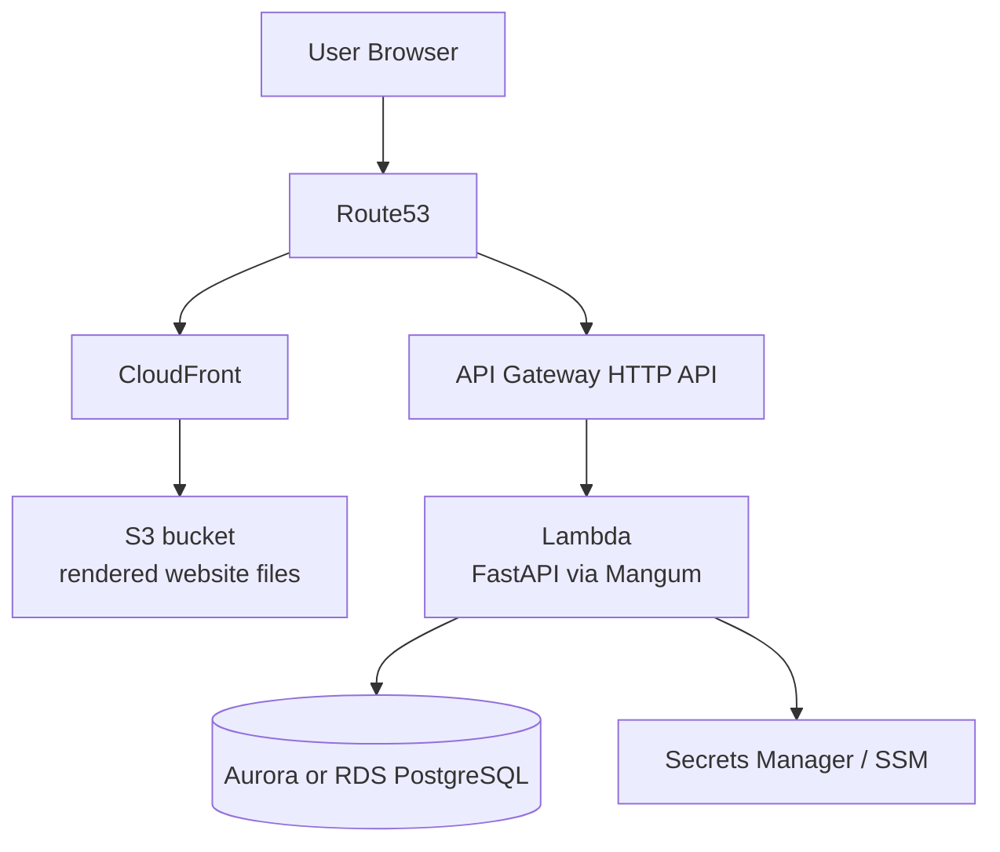

# Infrastructure Hosting Overview

This document describes how the website and API are hosted after the split between static website delivery and serverless API execution.

## TL;DR

- The website is hosted on `S3 + CloudFront`.
- The API is hosted on `API Gateway HTTP API + Lambda`.
- The website and API domains are derived from one root domain and the deployment environment.
- Lambda no longer serves the website assets.
- The frontend calls the API over the dedicated API domain, and API CORS is restricted to the website origin by default.

## Domain Model

The stack derives domains from `root_domain_name` and `environment`.

| Environment | Website | API |
|---|---|---|
| `dev` | `dev.plainplan.click` | `dev.api.plainplan.click` |
| `prod` | `plainplan.click` | `api.plainplan.click` |

Terraform still allows explicit overrides through `website_domain_name` and `custom_domain_name`, but the default path should be the derived domains above.

## Current AWS Topology

## Website Request Flow

Request path:

1. Browser requests the website domain
2. Route53 resolves the website hostname to CloudFront
3. CloudFront serves static files from the private S3 bucket
4. A CloudFront Function rewrites extensionless paths like `/docs` to `/docs.html`

Key implementation points:

- Website TLS uses an ACM certificate in `us-east-1`
- The S3 bucket is private
- CloudFront uses Origin Access Control to read from S3
- Terraform uploads the rendered website files from `public/`

## API Request Flow

Request path:

1. Client requests the API domain
2. Route53 resolves the API hostname to API Gateway
3. API Gateway forwards the request to Lambda
4. FastAPI handles `/api/*` and `/analyze`
5. Lambda talks to Aurora Serverless v2 or RDS depending on configuration

Key implementation points:

- API TLS uses a regional ACM certificate in the AWS region of the API Gateway deployment
- The website no longer routes through API Gateway
- Lambda now acts as the backend only

## Frontend / Backend Boundary

The website source still lives in `public/`, but it is now treated as a static site instead of app-served HTML.

The uploaded website files are rendered with environment-specific placeholders:

- `__WEBSITE_ORIGIN__`
- `__API_ORIGIN__`
- `__WEBSITE_HOST__`

That allows the same source files to be used for both:

- `dev.plainplan.click` + `dev.api.plainplan.click`
- `plainplan.click` + `api.plainplan.click`

The frontend now calls the API over the dedicated API origin instead of same-origin relative paths.

## CORS Model

API Gateway CORS is restricted to:

- the derived website origin for the current environment
- any optional entries in `additional_cors_origins`

That means:

- `dev` API allows `https://dev.plainplan.click`
- `prod` API allows `https://plainplan.click`

This is materially tighter than the previous `allow_origins = ["*"]` setup.

## Runtime Responsibilities

### S3 + CloudFront

Serves:

- homepage
- docs page
- dashboard shell
- `robots.txt`
- `sitemap.xml`

### Lambda

Serves:

- `GET /health`
- `GET /api`
- `GET /api/example`
- `POST /api/keys`
- `GET /api/keys/verify`
- `POST /api/analyze`
- `GET /api/dashboard`
- `POST /analyze` for the website playground

## Environment Layout

Terraform now includes environment-specific files for both current environments:

- `terraform/dev.tfvars`
- `terraform/prod.tfvars`
- `terraform/dev.backend.hcl`
- `terraform/prod.backend.hcl`

The GitHub Actions workflow can deploy:

- `dev` automatically on push
- `dev` or `prod` through manual dispatch

## Why This Split Is Better

Compared with serving the website through Lambda, this architecture:

- reduces Lambda invocations for public website traffic
- removes API Gateway request charges from static page delivery
- gives the site CDN caching through CloudFront
- keeps the backend isolated to the actual dynamic workloads
- preserves a clean website domain and a clean API domain in both environments

## Bottom Line

The stack now matches the intended boundary:

- `plainplan.click` / `dev.plainplan.click` is the website
- `api.plainplan.click` / `dev.api.plainplan.click` is the API
- Lambda is no longer used to host the website itself
